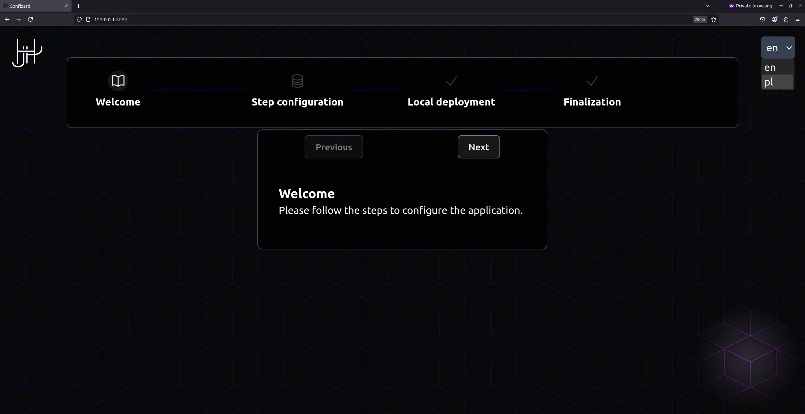

# Confizard
This project is about filling the gap in modern software configurators.

Parent project: [OwnLab](https://github.com/orgs/HJHPio/projects/2)  


## Configuration & Installation

### Quick Start

**TL;DR** Simply visit [confizard.hjhp.io](https://confizard.hjhp.io), follow the steps and use the generated script to deploy the application (see also [recursion](https://en.wikipedia.org/wiki/Recursion)).  

*The guide below will be deprecated after the final version of Confizard is released (at least that is currently the main goal 😉).*   
**NOTE**: Requires docker engine to be installed on the system (see [Docker Engine Official Installation Guide](https://docs.docker.com/engine/install/)).  
It is possible to quickly test and experiment with Confizard due to its self-configuring capabilities.
1. **Visit Confizard App Example** hosted on [confizard.hjhp.io](https://confizard.hjhp.io). 
2. **Configure Form For Your Application**: Following configurable steps this project is able to configure itself.
3. **Set Up Your Own Confizard Instance**: Using generated script on last step this project is able to deploy itself locally as a docker container.

### Advanced usage
After grasping the basics, the following are the functionalities currently supported by this project.
1. **Simple catalog structure**: All required configuration files are in folder steps-data (located in this repo in (repo-root)/frontend/public/steps-data). This folder contains the steps list file and translations used in the project. Example usage:
```sh
docker run -it --name confizard-app -p 80:80 -v ./steps-data:/etc/nginx/html/zero/steps-data hjhp/confizard:latest
```
2. **Internationalization**: To support translations, the following configurations are necessary:
   - Steps in file steps-data/steps.default.yaml need to use KEYS instead of VALUES. 
   - In file steps-data/supportedLocales.json should be provided a list of supported locales. 
   - In files steps-data/(locale).json key-value pairs should be provided supporting vue-i18n syntax (see also [Vue-I18n syntax guide](https://vue-i18n.intlify.dev/guide/essentials/syntax.html)).
3. **Syntax used in steps.default.yaml**: Example below introduces syntax with description in comments:
```yaml
- id: 0 # used to define the order of initial steps
  # below it's possible to use i18n syntax to internationalize parts of form content visible by end user like: step title and step description. For fields array its: label and description.                   
  title: "step.translate.example.title"                 
  description: "It's step description field."
  fields: # [] # its possible to leave this array empty in case of using step as additional info
    - name: "ENV_NAME_USED_IN_SCRIPT"
      label: "Human-readable label of env"
      type: "text" # supported input types are: text, number, checkbox, password, multiline
      # all fields below are optional for field configuration
      description: "Human-readable description of current field"
      default: "Default value if not provided" 
      multiplier: 0  # it allows to duplicate current field in step (TODO: provide info about final env syntax)
      sensitive: false # flags this field to mask its value in the final script review as well as table of configured envs
      obligatory: false # flags this field as required before going to next step
      configurable: false # it enables current field to add additional fields like field name or field type to be filled by end user
  # all fields below are optional for step configuration
  script: |
    echo 'Hello! You can use the environment variables configured in the fields here.'
  icon: "BookOpenIcon" # currently supporting:  BookOpenIcon, CircleStackIcon, CheckIcon with CheckIcon being default
  multiplier: 0 # it allows to duplicate current step in form (TODO: provide info about final env syntax)
  configurable: false # it enables current step to add additional fields like step title or step description to be filled by end user
# last step used for summary can also have script
- id: 1
  title: "step.finish.title"
  description: "step.finish.description"
  script: "echo 'Final step completed in Confizard'"
```
4. **Hosting configuration files externally** - It is possible to host configuration files (located in folder steps-data) on external server (for example [nginx](https://nginx.org/)). There are two supported options: 
   - Use .env file while building with variable VITE_EXTERNAL_CONFIG_URL_BASE=(link to externally hosted folder)
   - Use url path parameter "extConfUrl" (example: "https://127.0.0.1:8080/?extConfUrl=http://127.0.0.1:80/")

<!-- ## Badges -->  
<!-- TODO: Add badges after adding integration with sentry.io --> 

## Description  
Every open-source project, to be quickly reusable by others, needs its own configuration wizard that shows end users how to configure the project and step-by-step explanation of the installation process. Confizard project aims for that specific field to provide a solution suitable for all projects: a configurable (and auto-configurable) wizard. Its solutions focus on using environments and scripts to provide an easy-to-maintain and understandable process. An Free and Open Source Software project author can provide end users with a simple form where based on user input translated then to system environments the final app can be automatically configured, installed and deployed based on user choices. It should never send data outside (the entire process should be encapsulated within the user's browser to ensure that no sensitive environment variables are leaked). Bug tracking features should only send data externally in testing environments.

## Gallery  

<!-- TODO: Add more project images -->

## Roadmap
[ROADMAP.md](./ROADMAP.md) file includes upcoming features and future plans.

## Changelog
[CHANGELOG.md](./CHANGELOG.md) file includes project changes in each release.

## Support
Everyone is welcome to submit an issue ticket on either GitHub or GitLab (depending on which platform this mirror of the project is hosted). Submitted issues will be automatically reviewed, and the main developer will be notified.
If you prefer private support (e.g., if you do not wish to share logs publicly), you can contact the project main developer via email at [support@hjhp.io](mailto:support@hjhp.io).

## Security
If you identify any security problems, please contact us immediately with the necessary details via email at [security@hjhp.io](mailto:security@hjhp.io).  
Please note that the email could end up in the spam folder. If you do not receive a timely response, please try emailing again.  
If the detected vulnerability is critical and the response to emails is not fast enough, please create an issue ticket to inform others and mitigate potential risks.
For more information please refer to [SECURITY.md](./SECURITY.md) file.

## Contributing
Everyone is welcome to contribute via GitHub pull requests or GitLab merge requests.
After reviewing and merging into the respective branches (*github-main* / *gitlab-main*), the final version of the software will be merged into the main branch on the private Git instance, and then all existing mirrors will be updated.  
Instructions on how to contribute can be found in [CONTRIBUTING.md](./CONTRIBUTING.md) file.

## Attribution
This project is maintained by its contributors.
The main tools and technologies used are listed in the [ATTRIBUTION-manual.md](./ATTRIBUTION-manual.md) file.
Automatically detected dependencies and their acknowledgments are listed in the [ATTRIBUTION.md](./ATTRIBUTION.md). file.

## License
*TL;DR:* This project is licensed under the MIT License.  
Everyone is welcome to fork and use it for private and commercial purposes.  
Full license can be found in [LICENSE](./LICENSE) file.  

## Project status
The project is in its initial state.  
The scope and targets may change after discussions in issues.
